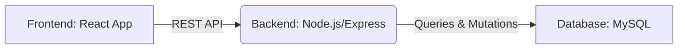
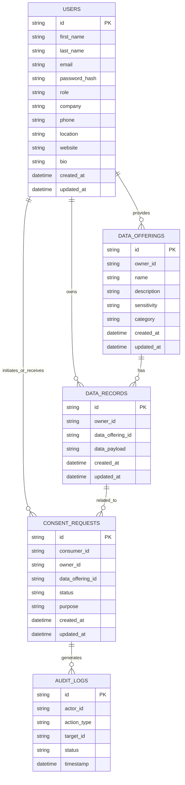

# Full-Stack Developer Assignment: User-Controlled Data Access Platform

## 🚀 Architecture Overview

This platform is designed as a secure B2B SaaS application facilitating user-controlled access to personal data. It follows a typical three-tier architecture:

-   **Frontend (Client-side):** Built with React, it provides a responsive and intuitive user interface for both Data Owners and Data Consumers. It interacts with the backend API to fetch and submit data.
-   **Backend (Server-side):** Developed using Node.js with Express, it exposes RESTful APIs for authentication, data management, consent management, and audit logging. It handles business logic, interacts with the database, and enforces security policies.
-   **Database:** A MySQL database serves as the persistent storage for user profiles, data records, consent states, and immutable audit logs.

## 🛠️ Tech Stack Reasoning

-   **Frontend: React**
    -   **Component-Based:** Facilitates modular and reusable UI components, speeding up development and maintenance.
    -   **Large Ecosystem:** Access to a vast array of libraries, tools, and community support.
    -   **Declarative UI:** Makes UI development more predictable and easier to debug.

-   **Backend: Node.js with Express**
    -   **JavaScript Everywhere:** Allows for a unified language across the full stack, reducing context switching and improving developer productivity.
    -   **High Performance (Non-blocking I/O):** Ideal for handling a large number of concurrent connections, crucial for a scalable SaaS platform.
    -   **RESTful API Development:** Express.js provides a robust and flexible framework for building REST APIs.

-   **Database: MySQL**
    -   **Robust & Reliable:** Known for its data integrity, reliability, and advanced features, widely used in production environments.
    -   **SQL Standard Compliance:** Ensures data consistency and provides powerful querying capabilities.
    -   **Scalability:** Well-suited for a variety of workloads and can be scaled horizontally.
    -   **JSON Support:** Efficiently stores and queries JSON data, useful for flexible user data records.

## 🔗 API List

The backend exposes a set of RESTful APIs to manage users, data, consent, and audit logs. All API endpoints are prefixed with `/api`.

### 🔐 Authentication

-   `POST /api/auth/register`:
    -   **Description:** Registers a new user (Data Owner or Data Consumer).
    -   **Body:** `{ email, password, role }`
    -   **Response:** `{ token, userId, role }`
-   `POST /api/auth/login`:
    -   **Description:** Logs in an existing user.
    -   **Body:** `{ email, password }`
    -   **Response:** `{ token, userId, role }`
-   `POST /api/auth/otp/request`:
    -   **Description:** Requests an OTP for passwordless login or password reset.
    -   **Body:** `{ email }`
    -   **Response:** `{ message: 'OTP sent' }`
-   `POST /api/auth/otp/verify`:
    -   **Description:** Verifies an OTP.
    -   **Body:** `{ email, otp }`
    -   **Response:** `{ token, userId, role }`

### 👤 Data Owner Features

-   `POST /api/owner/profile`:
    -   **Description:** Creates or updates the Data Owner's profile.
    -   **Body:** `{ /* profile data */ }`
    -   **Authentication:** Required (Owner)
-   `GET /api/owner/data`:
    -   **Description:** Retrieves the Data Owner's personal record.
    -   **Authentication:** Required (Owner)
-   `PUT /api/owner/data`:
    -   **Description:** Updates the Data Owner's personal record.
    -   **Body:** `{ record: { /* JSON/text data */ } }`
    -   **Authentication:** Required (Owner)
-   `GET /api/owner/requests`:
    -   **Description:** Views pending access requests for the Data Owner's record.
    -   **Authentication:** Required (Owner)
-   `PUT /api/owner/requests/:requestId/approve`:
    -   **Description:** Approves an access request.
    -   **Authentication:** Required (Owner)
-   `PUT /api/owner/requests/:requestId/reject`:
    -   **Description:** Rejects an access request.
    -   **Authentication:** Required (Owner)
-   `PUT /api/owner/access/:accessId/revoke`:
    -   **Description:** Revokes an active access consent.
    -   **Authentication:** Required (Owner)
-   `GET /api/owner/access/history`:
    -   **Description:** Views the access history for the Data Owner's record.
    -   **Authentication:** Required (Owner)

### 💰 Data Consumer Features

-   `GET /api/consumer/search`:
    -   **Description:** Searches for Data Owners by email or ID.
    -   **Query:** `?email=<email>&id=<id>`
    -   **Authentication:** Required (Consumer)
-   `POST /api/consumer/request-access`:
    -   **Description:** Requests access to a Data Owner's record.
    -   **Body:** `{ ownerId }`
    -   **Authentication:** Required (Consumer)
-   `GET /api/consumer/data/:ownerId`:
    -   **Description:** Views a Data Owner's record if consent is active.
    -   **Authentication:** Required (Consumer)
-   `GET /api/consumer/access/status/:ownerId`:
    -   **Description:** Checks the access status for a Data Owner's record.
    -   **Authentication:** Required (Consumer)

### 📜 Audit Logs

-   `GET /api/audit/history`:
    -   **Description:** Retrieves a user's audit log history (for authorized roles).
    -   **Authentication:** Required (Admin/Owner for own logs)
## 📸 UI Screenshots

To provide a visual overview of the application, screenshots of key user interfaces will be added here.

### Login/Registration Page

*   **Description:** This will show the unified login and registration interface, highlighting options for email/password or OTP authentication.

### Data Owner Dashboard

*   **Description:** A view of the Data Owner's personalized dashboard, where they can manage their profile, view their data record, and see an overview of consent requests.

### Data Owner: Manage Consent Requests

*   **Description:** This screenshot will illustrate the interface for Data Owners to view pending access requests and approve or reject them.

### Data Owner: View Access History

*   **Description:** A visual representation of the Data Owner's access history, showing who accessed their data, when, and the consent status.

### Data Consumer Dashboard

*   **Description:** The Data Consumer's dashboard, providing options to search for Data Owners and manage their own access requests.

### Data Consumer: Request Access to Record

*   **Description:** This image will show the flow for a Data Consumer requesting access to a Data Owner's record.

### Data Consumer: View Approved Record

*   **Description:** A screenshot demonstrating how a Data Consumer views a Data Owner's record after explicit consent has been granted.

## 🗄️ Database Design

### 📊 ER Diagram (Conceptual)

### Consent Lifecycle

1.  **Pending:** A Data Consumer requests access to a Data Owner's record. A new `CONSENT` entry is created with `status: 'pending'`.
2.  **Approved:** The Data Owner reviews and approves the request. The `CONSENT` entry's `status` is updated to `'approved'`, and `approved_at` is timestamped. The Data Consumer can now view the record.
3.  **Rejected:** The Data Owner reviews and rejects the request. The `CONSENT` entry's `status` is updated to `'rejected'`, and `rejected_at` is timestamped. Access is denied.
4.  **Revoked:** At any point, the Data Owner can revoke an `'approved'` consent. The `CONSENT` entry's `status` is updated to `'revoked'`, and `revoked_at` is timestamped. Access is immediately terminated.

Each state change is recorded in the `AUDIT_LOGS` table.

### Access Control

Access control is implemented using a combination of JWT-based authentication and role-based authorization:

-   **Authentication:** JWTs issued upon login verify the user's identity.
-   **Authorization:** Middleware checks the user's role (`owner` or `consumer`) and the specific `consent` status before granting access to data records or performing sensitive actions.
-   **Data Ownership:** `DATA_RECORDS` are tied directly to `owner_id` in the `USERS` table, ensuring only the owner can modify their data.
-   **Consent Enforcement:** When a Data Consumer requests to view a record, the system verifies an active (`'approved'`) consent for that specific `owner_id` and `consumer_id` pair.

### Audit Immutability

-   The `AUDIT_LOGS` table is designed for immutability, meaning records, once created, are never modified or deleted.
-   All access events, consent state changes, and critical user actions generate a new, append-only entry in this table.
-   The `timestamp` column ensures a chronological record of all events.
-   `event_details` (JSONB) can store structured context about each event, providing rich audit trails.

## 🔒 Security & Privacy

### Preventing Unauthorized Access

-   **JWT Authentication:** All authenticated API endpoints require a valid JWT. Tokens are short-lived and refreshed securely.
-   **Role-Based Access Control (RBAC):** Middleware checks the user's role and permissions for every protected route. For instance, only Data Owners can modify their records, and Data Consumers can only view records with active consent.
-   **Input Validation & Sanitization:** All incoming data is rigorously validated and sanitized on the backend to prevent injection attacks (SQL, XSS, etc.).
-   **Password Hashing:** User passwords are never stored in plain text. Secure hashing algorithms (e.g., bcrypt) are used to store password hashes.
-   **HTTPS/SSL:** All communication between the frontend and backend is encrypted using HTTPS to protect data in transit.

### Avoiding Privilege Escalation

-   **Strict RBAC Policies:** Permissions are finely grained. Users are only granted the minimum necessary privileges required for their role.
-   **Server-Side Validation:** All access control decisions are made and enforced on the server-side, preventing client-side bypasses.
-   **Ownership Checks:** When an action involves a specific resource (e.g., a Data Owner's record or a consent request), the system always verifies that the authenticated user is the legitimate owner or has appropriate permissions for that resource.
-   **No Dynamic Code Execution:** The platform avoids executing user-provided code to prevent arbitrary code execution vulnerabilities.

### Protecting Audit Logs

-   **Immutability:** As described in the DB Design, audit logs are append-only. There are no API endpoints or database operations to modify or delete existing audit log entries.
-   **Access Restrictions:** Only authorized personnel (e.g., system administrators) or the Data Owner for their own specific logs can retrieve audit log information. Access to the raw database containing audit logs is highly restricted.
-   **Tamper Detection (Future Consideration):** For extremely high-assurance scenarios, cryptographic hashing or blockchain-like structures could be considered to further ensure the integrity and tamper-proof nature of audit logs.

### Scaling Data Access Safely

-   **Database Indexing:** Appropriate indexes on `user_id`, `record_id`, and `timestamp` columns will ensure efficient retrieval of data and audit logs, even as data grows.
-   **Connection Pooling:** The backend uses database connection pooling to manage connections efficiently and prevent performance bottlenecks under heavy load.
-   **Rate Limiting:** API endpoints susceptible to abuse (e.g., login, OTP requests, access requests) can implement rate limiting to prevent brute-force attacks and ensure fair resource usage.
-   **Asynchronous Processing (Future Consideration):** For very high-volume audit logging or complex data processing, an asynchronous queueing system (e.g., Kafka, RabbitMQ) could be introduced to decouple the logging process from the main request flow, improving responsiveness.

### Handling Compliance Concerns

-   **Explicit Consent:** The platform's core design mandates explicit consent for data access, directly addressing privacy regulations like GDPR, CCPA, etc.
-   **Auditability:** Comprehensive audit logs provide a clear, immutable trail of all data access and consent changes, which is crucial for demonstrating compliance during audits.
-   **Right to Access & Rectification:** Data Owners have features to view and update their personal records (`/api/owner/data`), fulfilling data subject rights.
-   **Right to Erasure (Pseudonymization/Anonymization):** While direct data deletion might conflict with audit requirements, the platform could implement pseudonymization or anonymization strategies for user data upon request, rendering it unidentifiable while preserving audit trails. Full deletion would require careful consideration of legal and technical implications for audit logs.
-   **Data Minimization:** The system is designed to collect and store only the necessary data required for its functionality.